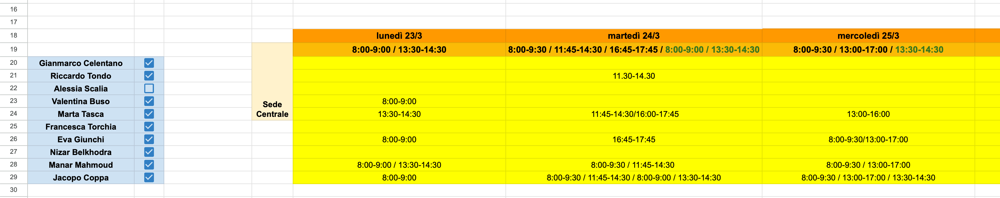
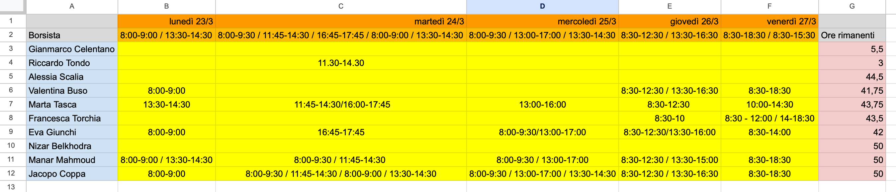
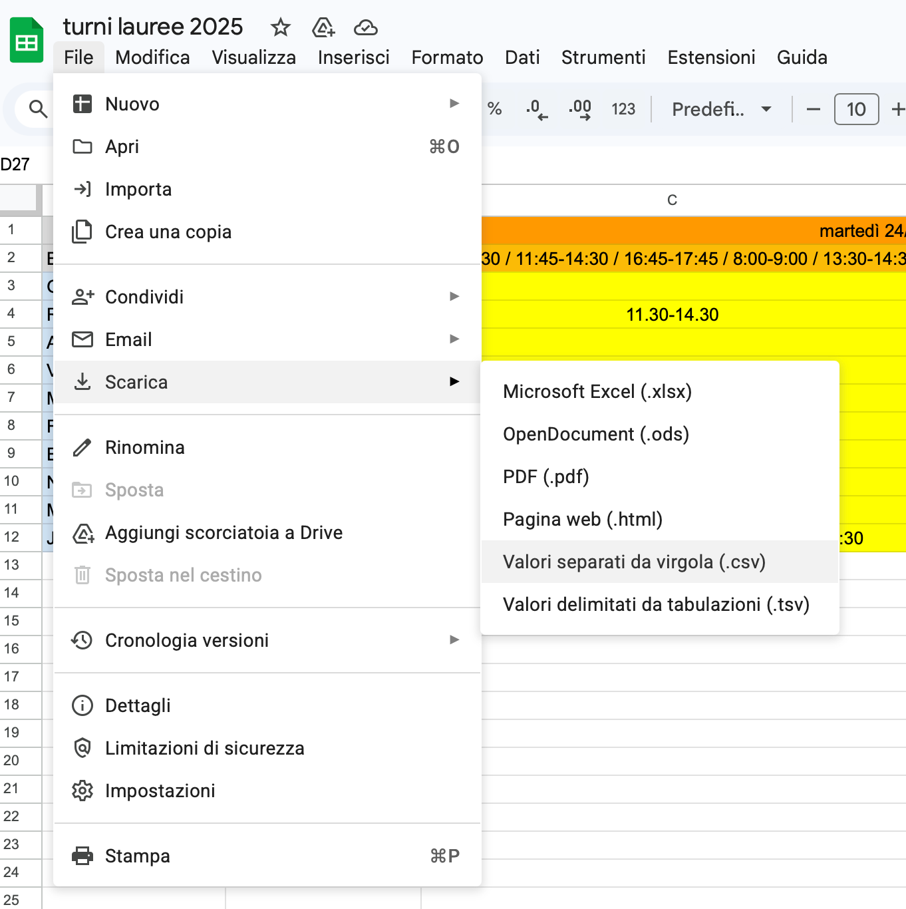
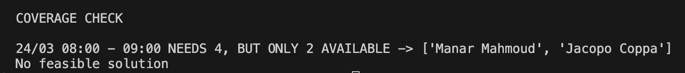

# Pianificatore di Turni

Uno strumento basato su Python per la pianificazione dei turni da dati CSV con parametri configurabili.

## Utilizzo

### Passaggio preliminare: ambiente di esecuzione
Lista degli elementi necessari (o consigliati) per seguire comodamente il procedimento
- IDE per Python (VisualStudio/PyCharm)
- Plugin per visualizzare CSV (EditCSV per Visual Studio)
- Python > 3.11
- ! Google OR-Tools module - `python3 -m pip install ortools` da terminale

### Passaggio 1: Preparare i Dati di Input
Assicurarsi che la tabella principale delle disponbilità sia compilata nel modo corretto (segue foto)
- ogni riga corrisponde ad un borsista (tabella sinistra azzurra in foto)
- date dei turni da coprire, nel formato DD/MM (riga arancione scuro in foto)
- fasce orarie dei turni da coprire nel formato hh:mm-hh:mm / .. (riga arancione chiaro in foto)
    - in caso di più postazioni da coprire nella stessa fascia oraria (es. Energy Center) inserire più volte quella fascia oraria
- ogni borsista compila le rispettive celle della tabella con le sue disponibilità in termini di fasce orarie. Le postazioni multiple vanno comunque considerate una solta volta (es. cella F28)

Ricopiare le informazioni sui borsisti, le loro disponibilità e i turni da coprire nel foglio `disp_tmp` (come in foto)

Esportare il foglio in formato .csv (dovrebbe rinominarsi `turni lauree 2025 - disp_tmp.csv`) e inserirlo nella cartella del progetto.

### Passaggio 2: Pulire i Dati
Eseguire lo script di pulizia dei dati. Aprire il file `clean.py` e eseguirlo (tasto 'play')

Questo genererà 3 file:
- `disponibilita.csv` per le disponibilità dei borsisti
- `turni.csv` per i turni da coprire
- `max_ore.csv` per le ore rimanenti di ogni borsista

### Passaggio 3: Configurare i Parametri
Verificare che i parametri predefiniti in `config.py` soddisfino le esigenze.

### Passaggio 4: Generare la Pianificazione
Eseguire lo script di pianificazione dei turni. Aprire il file `schedule.py` e eseguirlo (tasto 'play')

In caso tutti i turni siano coperti, sarà generato il file `schedule.csv` ovvero una tabella con i turni assegnati e le ore totali (ultima colonna) della settimana per ogni borsista

Altrimenti, un messaggio come questo sarà stampato:

### Passaggio 5: Rivedere il risultato
Controllare l'output in `schedule.csv` e copiare i risultati nel file Excel originale (foglio `Turni def. Marzo-Aprile`). Nota che l'ordine/formato delle righe potrebbe differire.

## File

- `raw.csv` - File di dati di input
- `clean.py` - Script di pulizia dei dati
- `config.py` - Parametri di configurazione
- `schedule.py` - Script di pianificazione
- `disponibilità.csv` - File di output delle disponibilità
- `turni.csv` - File di output dei turni da coprire
- `max_ore.csv` - File di output delle ore rimanenti per borsista
- `schedule.csv` - File di output della pianificazione